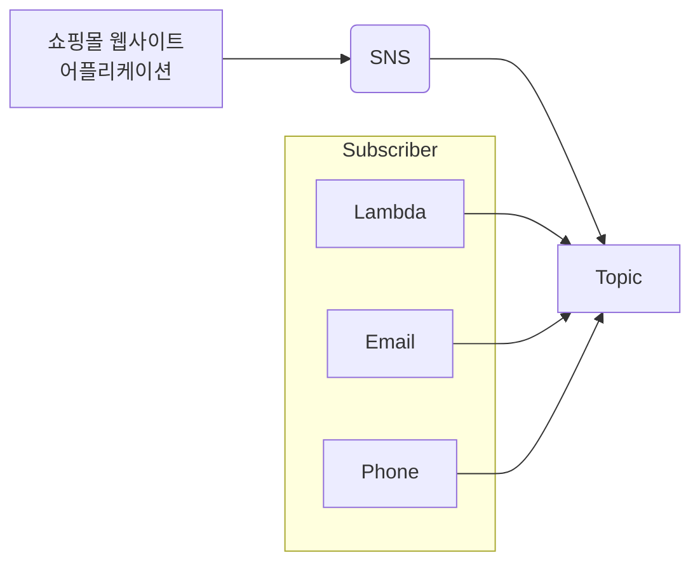

# SNS (Sinple Notification Service)

- 클라우드로부터 Notifications를 전달받는 용도로 사용
- 어플리케이션으로부터 전달받은 메세지들은 다른 어플리케이션 혹은 구독자들에게 전달됨

## SNS 활용 용도

### Push Notifications
- 핸드폰 & 태블릿 (IOS, 구글, 윈도우, 안드로이드 호환)

### Email
- SQS 혹은 다른 http endpoint로 전송

### Lambda
- Lambda를 호출하여 message 처리
- 다른 SNS로 보내거나 다른 AWS 리소스로 전송

## PUB - SUB MODEL
- Publish : SNS 메세지를 특정 토픽으로 보내라
- Subscribe : 내가 구독한 토픽으로 들어오는 메세지를 전달 받는다.

### topic
- 구매자들이 Subscribe하고 메세지를 전달받는 만남의 광장 역할

## 아키텍처 다이어그램 (Mermaid)

## SNS 장점
- 메시지를 즉시 보냄 (X 딜레이)
- 간편함
- 뛰어난 호환성
- 저렴한 비용
  - SNS를 구축하고 토픽을 만든다고 해서 비용이 발생하지 않음
  - 토픽에 특정 메시지가 들어오고 구독자들에게 읽혀질 때 비용발생