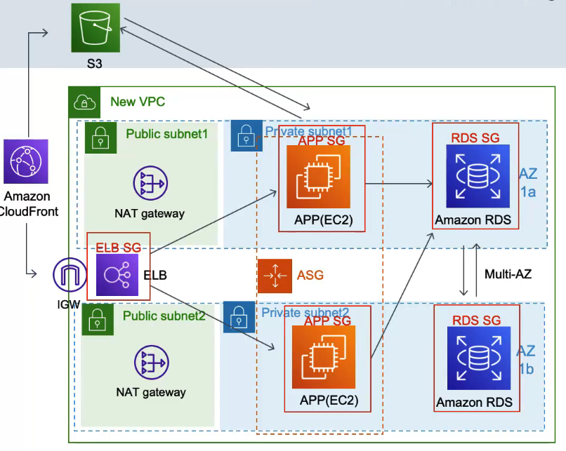

## 아키텍처 잘 만든거 같은데요. 고객들이 많이 늘면서 불만 사항들이 올라오네요. 쇼핑몰이 좀 느린거 같다고요.
- WEB, APP 서버가 느리면 Autoscaling이 자동으로 늘려주고, DB가 문제면 더 좋은 인스턴스로 바꿔주고 해서 느릴 일 없는데 뭐 때문에 느린가?
- 고객들이 한국에만 있는게 아니라 다른 나라에서 접근하면 인터넷이 느려서 느릴수가 있음
- 어떻게 하면 고객들이 우리서버에 있는 이미지나 파일들을 빨리 다운 받을 수 있을까?

## 다른 회사에 물어 보니, 데이터를 빨리 보내기 위해 캐시를 사용한데요.
- 캐시(Cache)는 사용자랑 가까운데 위치의 장비에다 데이터를 저장해 놓고 요청이 들어오면 데이터 센터까지 요청해서 데이터를 사용자에게 보내주는 게 아니고
- 가까운데 이미 저장되어 있는 곳에서 데이터를 보내줌
- 이런걸 CDN (Content Delivery Network) 기능이라고도 함.
- AWS에서는 CloudFront라는 서비스가 있음

## CloudFront를 설정해 줄 거에요
- Clouffont가 캐시해야 할 원본 데이터를 가지고 있는 주소를 입력해 주면 됨
- S3와 ELB 주ㅗ 넣어주면 될거 같음
- 글로벌하게 Cloudfront를 배포 하면 AWS인프라의 전세계의 Edge location이라는 곳에 배포가 된다고 함
- 해외에서도 쇼핑몰의 이미지나 동영상들을 받아가는 속도가 빨라질거라 기대함