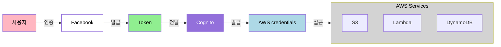
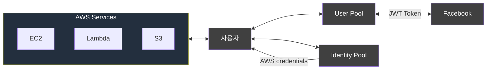
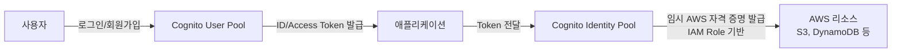

# Cognito

Web Identity Federation 기능 제공

## Congnito 주요 특징
- 회원가입, 로그인 기능 (Guest로 로그인 가능)
- 어플리케이션과 Web Provider간의 중재자 역할
- 다양한 기기로부터 사용자 정보를 동기화함 -> 확장성
- 사용자 Credentials을 자동으로 관리
- Facebook, Google과 같은 소설미디어를 통한 WIF

## 인증 흐름
사용자 -> Facebook(Token) 발급 -> Token으로 Cognito에 문의 -> Cognito에서 AWS Credentials발급 -> 해당 Credentials로 AWS 리소스 접근

## Cognito User Pool
- 모바일, 웹 어플리케이션의 회원가입과 로그인 기능을 관리하는 곳
- 유저는 User Pool을 거쳐 직접 로그인을 할 수 있음
- Json Web Token (JWT)

## 아키텍처 다이어그램

## Cognito User Pool vs Identity Pool 차이
### 🔐 Cognito User Pool
- *사용자 인증(Authentication)*을 담당.
- 회원가입, 로그인, 비밀번호 찾기 등 사용자 관리 기능 제공.
- OAuth2 / SAML / Social Login(Google, Apple 등) 지원.
- 인증이 완료되면 ID 토큰 / Access 토큰을 발급.
- 주로 애플리케이션 로그인 시스템을 만들 때 사용.

### 🎫 Cognito Identity Pool (Federated Identities)
- 인증된 사용자에게 AWS 리소스 접근 권한 부여(Authorization).
- User Pool, Google, Apple, SAML 등 다양한 인증 소스와 연동 가능.
- 인증된 사용자에게 *임시 AWS 자격 증명(temporary AWS credentials)*을 발급(IAM Role 기반).
- S3, DynamoDB 등 AWS 서비스에 직접 접근하는 구조를 만들 때 필요.

## 실습

### Cognito 검색

- 비즈니스 사례에서 시작 > 풀다운 선택 
- 앱에 사용자 디렉터리 추가 > 사용자 풀 생성
  - 일반적으로 이것 선택
- AWS 서비스에 대한 액세스 권한 부여 > 자격 증명 풀 생성

### Amazon Congnito > 사용자 풀 > 사용자 풀 생성
- Cognito 사용자 풀 로그인 옵션 선택
  - 사용자 이름
  - 이메일
  - 전화번호

- 보안 요구 사항 구성
  - 기본값
  - 사용자 지정

- 멀티 팩터 인증 선택 (MFA)

- 사용자 계정 복구
  - 암호 잃어버렸을때 복구 할수 있게 하는 방법
  - 이메일, SMS 등 지정가능

- 가입 환경 구성
  - 셀프 서비스 가입
    - 앱의 새 사용자가 계정을 직접 등록 할수 있을지 선택
    - 회원 가입 URL제공

- 속성 확인 및 사용자 계정 확인
  - MFA확인 방법
    - SMS 메시지 전송, 전화번호 확인
    - 이메일 전송, 이메일 주소 확인
    - 전화번호 우선, 없으면 이메일

- 속성 변경 확인
  - 이메일이나 전화번호 변경에 대응 하는가

- 메시지 전송 구성
  - 이메일 공급자
    - Amazon SES사용
    - Cognito를 사용하여 이메일 전송

- 앱 통합
  - 사용자 풀 이름 지정 (변경불가)
  - 초기 앱 클라이언트
    - 해당 기기가 안전한지 확인
      - 퍼블릭 클라이언트
      - 기밀 클라이언트
      - 기타
  - 앱 클라이언트 이름 지정
  - 클라이언트 보안키
  - 고급 앱 클라이언트 설정
    - 인증 흐름 선택
    - 인증 흐름 세션 기간 : 3분
    - 갱신 토큰 만료 : 30일
    - 액세스 토큰 만료 : 60분
    - ID 토큰 만료 60분

- 생성

- 생성 후 앱 통합 탭
  - 사용자 풀을 앱과 연동 해야 햄
    - 도메인 주소를 보유 하고 있다면 연동, 아니면 cognito에서 도메인 생성
  - 앱 클라이언트 목록
    - 앱 클라이언트 이름 클릭
    - 호스팅 UI 편집
    - 허용된 콜백 URL
      - URL 추가
    - 자격 증명 공급자
      - Cognito 사용자 풀 선택
    - OAuth 2.0 권한 부여
      - 권한 부여 코드 부여 선택
      - 암시적 권한 부여 선택
    - OpenID Connect 범위
      - 이메일
      - OpenID
      - aws.cognito.signin.user.admin
    - 호스팅 UI 사용자 지정
      - 로고 이미지 선택 가능
    - 도메인의 URL 복사해서 확인
      - /login?response?type=token&client_id=(복붙)&redirect_uri=(복붙)
    - 해당 페이지가 작동되는지 확인
    - 유저 등록
    - 사용자 탭에서 유저 확인