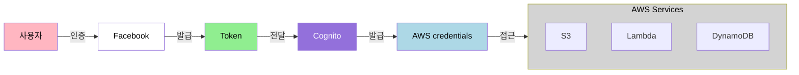
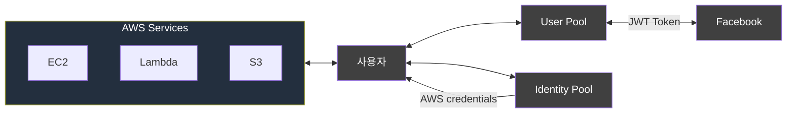
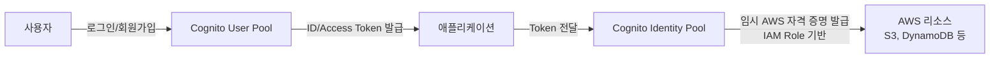

# Cognito

Web Identity Federation 기능 제공

## Congnito 주요 특징
- 회원가입, 로그인 기능 (Guest로 로그인 가능)
- 어플리케이션과 Web Provider간의 중재자 역할
- 다양한 기기로부터 사용자 정보를 동기화함 -> 확장성
- 사용자 Credentials을 자동으로 관리
- Facebook, Google과 같은 소설미디어를 통한 WIF

## 인증 흐름
사용자 -> Facebook(Token) 발급 -> Token으로 Cognito에 문의 -> Cognito에서 AWS Credentials발급 -> 해당 Credentials로 AWS 리소스 접근

## Cognito User Pool
- 모바일, 웹 어플리케이션의 회원가입과 로그인 기능을 관리하는 곳
- 유저는 User Pool을 거쳐 직접 로그인을 할 수 있음
- Json Web Token (JWT)

## 아키텍처 다이어그램

## Cognito User Pool vs Identity Pool 차이
### 🔐 Cognito User Pool
- *사용자 인증(Authentication)*을 담당.
- 회원가입, 로그인, 비밀번호 찾기 등 사용자 관리 기능 제공.
- OAuth2 / SAML / Social Login(Google, Apple 등) 지원.
- 인증이 완료되면 ID 토큰 / Access 토큰을 발급.
- 주로 애플리케이션 로그인 시스템을 만들 때 사용.

### 🎫 Cognito Identity Pool (Federated Identities)
- 인증된 사용자에게 AWS 리소스 접근 권한 부여(Authorization).
- User Pool, Google, Apple, SAML 등 다양한 인증 소스와 연동 가능.
- 인증된 사용자에게 *임시 AWS 자격 증명(temporary AWS credentials)*을 발급(IAM Role 기반).
- S3, DynamoDB 등 AWS 서비스에 직접 접근하는 구조를 만들 때 필요.

