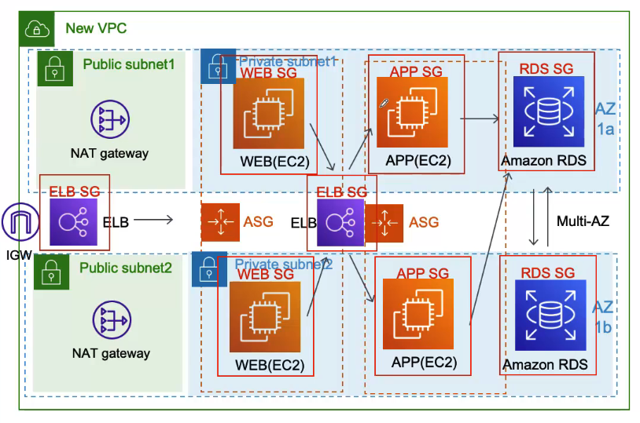

## 이제 다된 것 같아요. 더이상 APP 서버, DB서버 해킹은 없는것 같아요.
- Security Group 설정해서 제가 열어준 포트 말고는 다 막혀서 보안은 좋아졌는데, 생각해보니까 조금 더 철저하게 하려면 RDS는 APP 서버에서 오는 트래픽만 허용하고,
- APP 서버는 WEB 서버에서 오는 트래픽만 허용하고, WEB서버는 ELB에서 오는 것만 허용하고 다른데서 오는건 다 차단하면 더 좋을것 같음.
- 그래서 Srcurity Group의 Source 메뉴에서 바로 전 서버들의 Security Group을 선택해줌. 이렇게 Security Chain이 완성되어 보안이 더 강화됨.

## 제가 필요한건 다된 거 같아요. 이제 다시 비지니스에만 신경 쓰면 될거 같아요.
- 힘들었어요. 근데 뭔가 단단한 아키텍처가 된거 같아서 안심이 됨
- 이제 아무리 많은 트래피이 들어와도 급하게 서버 늘리느라 스트레스 안받아도 됨
- Autoscaling 기능이 자동으로 해줄 테니까
- 그리고 쓸지 안쓸지도 모르는 서버 예측해서 미리 사둘 필요 없음
- 데이터 센터가 장애가 나도 2개의 가용영역을 사용하니까 다른 한쪽으로 사용 가능
- EC2 인스턴스 들은 장애가 나면 Autoscaling이 복구해 줄거임
- 완변한거 같음

## 몇개월간 잘 운영되다가 또 장애가남. 원인을 모르겠음

## 클라우드도 장애가 나나요?
- 모든건 장애가 발생함

## 찾았어요! RDS에서 장애가 나서 전체 시스템이 죽었던 거에요.
- 아키텍처는 고가용성으로 만들어야 함
- 고가용성은 전체 시스템이 죽지 않고, 오래동안 잘 운영 되는 거를 말함
- 고가용성은 장애가 나더라도 알아서 성능이 떨어지지 않게 유지하면서, 자동으로 복구가 되어야 함
- 그렇게 하기위해서 이중화를 잘하여 한쪽에서 장애가 나더라도 다른 쪽으로 사용하여 시스템을 운영함으로써 전체 시스템이 장애가 나는 것을 방지해야 함
- 앞에서 지금 아키텍처도 가용영역을 2개를 사용하는 이유도 고가용성 때문에 그렇슴

## 아키텍처 설계에 중요한 부분은, 단일 장애 지점을 없애야 한다네요.
- SPOF(Single point of failure) 단일 장애 지점은 한부분이 장애가 나면 전체 시스템에 영향을 미침
- 단일 장애 지저을 없애야 할것 같음. RDS는 단일 장애 지점이니까
- RDS를 이중화 하면 될거 같음. RDS기능 중에 Multi-AZ 기능을 활성화 하면 된다고 함
- 그러면 똑같은 DB가 다른 가용 영역에 복사가 되고 실시간으로 동기화가 됨
- 그러다 Primary DB서버가 장애가 나면 접속주소가 Secondary DB로 변경되어 FailOver(장애 극복)한다고 함
- Multi-AZ 기능 너무 좋은거 같음. 하지만 비용이 2배로 나감