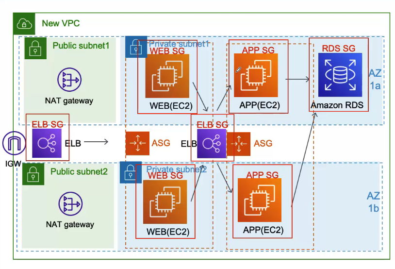

## SESSION MANAGER 사용하니까 SECUTIRY GROUP에서 SSH 포트는 뺴도 될 것 같아아요.
- 처음 EC2 인스턴스 만들 때 Security Group을 딱 필요한 포트만 열어야 한다고 해서 http(80), https(443) 포트만 열고 SSH는 없앰
- 이제 다른 포트들은 다 차단이 되고 http, https 두 개로 들어오는 트래픽만 EC2 인스턴스에 전달 될 거임
- 들어오는 포트는 열어줬는데 그럼 나가는 포트는? 나가는 포트는 자동으로 열린다고 신경안써도 된다고 함
- DB도 mysql은 3306을 쓰니 이것만 열어 줌
- ELB는 http, https 포트 열어줬음

## 각 INSTANCE에 SECURITY GROUP 으로 방화벽을 설정해 줬는데요, SECURITY GROUP 끼리 연결하면 SECURITY CHAIN 이라는 더 강력한 방화벽을 만들 수 있다네요
- DB는 APP Instance에서 오는 트래픽만 받으면 되고 APP Instance는 Internal ELB에서 오는 트래픽만 받으면 됨
- Internal ELB는 WEB Instance에서 트래픽만 받으면 됨
- WEB Instance는 ELB에서 오는 것만 받으면 됨
- 바로 앞에서 오는 트래픽만 빼고는 다 차단하면 될것 같음
- Security group에서 Source라는 부분에서 어디서부터 오는 트래픽을 받을지 설정 하는 부분이 있음