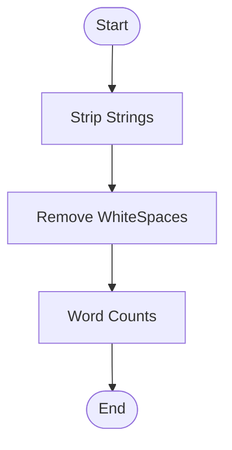
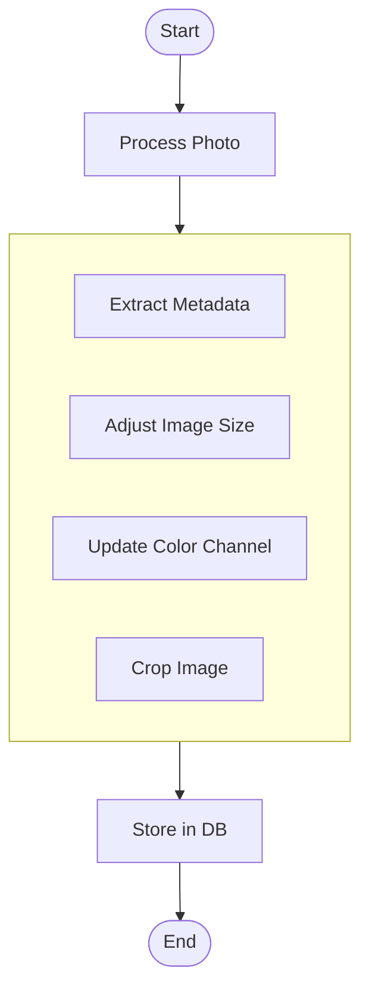

# Step Function

- Serverless 어플리케이션을 구축함에 있어 시각적 인터페이스 제공
- 일련의 Step으로 Serverless 어플리케이션을 관리할 수 있음
- Step은 Business Logic에 의해 순서대로 실행되어짐
- Step의 output은 또다른 Step의 input이 될 수 있음

## Sequential Workflow
- State Machine 라고도 부름
- 하나의 람다함수를 태스크 라고 부름

## Parallel Workflow

