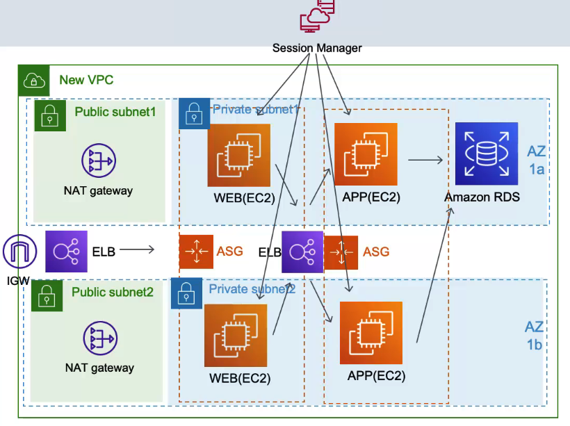

## 주요 INSTANCE들을 외부에서 접근은 못하게 해놔서 보안은 한층 강화 됐어요. 하지만 저도 접글을 못하네요. 관리 어떻게 하죠?
- Bastion(수호자) Instance를 Public Subnet에 놔두고 SSH로 접근한 다음에 Bastion Instance로 다른 Instnace들을 관리하면 되지 않을까?
- 좋은 생각 인거 같음. 하지만 이렇게 사용하는게 위험할 수 있음
- 만약 Bastion Instance가 해킹당하면 모든 Instance가 위험할 수 있음

## Session Manager를 사용하면 BASTION INSTANCE 없이 AWS 내에서 INSTANCE에 MANAGEMENT CONSOLE을 통해 접근 할수 있네요
- Bastion Instance 보다 좀더 보안이 좋은 session Managr를 사용할거임
- AWS Management COnsole에서 직접 Instance들에 접근할 수 있게 해주는 서비스
- BASTION 서버 안써도 되니 관리 안해도 되고 편할거 같음. 보안도 좋아짐
- Session Manager를 사용하면 Systems Manager agent가 설치 되어 있어야 하고 권한도 필요함