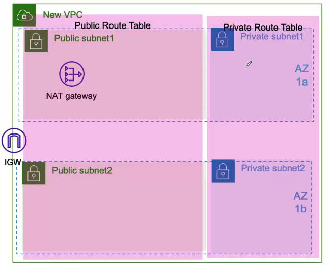

# VPC 실습

- VPC검색
- Create VPC 버튼은 만들기 쉬운데 익숙하지 않으면 어러움
- Your VPCs 메뉴 선택
## Create VPC
  - Resources to create
    - VPC only
  - Name tag - optional
    - LuckyVPC
  - IPv4 CIDR block
    - IPv3 CIDR manual input
  - IPv4 CIDR
    - 10.0.0.0/16
  - IPv6 CIDR block
    - No IPv6 CIDR block
  - Create 버튼 선택으로 작성
- 만들어진 VPC 체크 > Actions > Edit VPC settings
  - DNS settings
    - Enable DNS resolution : 자동체크 되어있음
    - Enable DNS hostnames : 체크
  - 저장
## subnets
  - 첫번째 구성
    - 만들어진 VPC 체크 > Create subnet
    - VPC ID
      - LuckyVPC
    - Sebnet settings
      - Subnet 1 of 1
      - subnet name
        - LuckyPub1
      - Avaliablity Zone
        - Asia Pacific (seoul) / ap-northeast-2a
      - IPv4 CIDR block
        - 10.0.0.0/24
      - key
        - name
      - value
        - LuckyPub1
      - create subnet 버튼
    - 한번더 만들어진 VPC 체크 > Create subnet
    - VPC ID
      - LuckyVPC
    - Sebnet settings
      - Subnet 1 of 1
      - subnet name
        - LuckyPri1
      - Avaliablity Zone
        - Asia Pacific (seoul) / ap-northeast-2a
      - IPv4 CIDR block
        - 10.0.1.0/24
      - key
        - name
      - value
        - LuckyPri1
      - create subnet 버튼
  - 두번째 구성
    - 만들어진 VPC 체크 > Create subnet
    - VPC ID
      - LuckyVPC
    - Sebnet settings
      - Subnet 1 of 1
      - subnet name
        - LuckyPub2
      - Avaliablity Zone
        - Asia Pacific (seoul) / ap-northeast-2b
      - IPv4 CIDR block
        - 10.0.2.0/24
      - key
        - name
      - value
        - LuckyPub2
      - create subnet 버튼
    - 한번더 만들어진 VPC 체크 > Create subnet
    - VPC ID
      - LuckyVPC
    - Sebnet settings
      - Subnet 1 of 1
      - subnet name
        - LuckyPri2
      - Avaliablity Zone
        - Asia Pacific (seoul) / ap-northeast-2b
      - IPv4 CIDR block
        - 10.0.3.0/24
      - key
        - name
      - value
        - LuckyPri2
      - create subnet 버튼
- Internet gateways > Create internet gateway
  - Name tag
    - LuckyIGW
  - Create internet gateway 버튼
- 만들어진 인터넷 게이트웨서 에서 Actions > Attach to VPC 선택
  - Available VPCs
    - 아마도 자동 선택
  - Attach internet gateway 버튼
## Route tables
- Create route table
  - Route table settings
    - Name - optional
      - LuckyPubRT
    - VPC
      - LuckyVPC
  - Tags
    - Key : name
    - Value : LuckyPubRT
  - Create route table 버튼
- 만들어진 route table 선택
  - Subnet associations 탭
    - Editsubnet associations 선택
    - LuckyPub1, LuckyPub2 체크 > Save associations 버튼
  - Routes 탭
    - 만들어 져있는것 확인 가능
      - Destination : 10.0.0.0/16
      - Target : local
      - Status : Active
    - Edit routes 버튼 선택
      - Add route
        - Destination : 0.0.0.0/0
        - Target : igw-xxxxxxxxxxxx
      - 이렇게 되면 내부에 있는 통신도 전부 외부로 갈것 같지만 범위가 작은 10.0.0.0/16 먼저 적용되서 문제가 안된다고 한다.

## subnets
- LuckyPub1 체크 > Actions
  - Edit Subnet settings
    - Enable auto-assign public IPv4 address 체크
    - Save 버튼
- LuckyPub2 체크 > Actions
  - Edit Subnet settings
    - Enable auto-assign public IPv4 address 체크
    - Save 버튼

## NAT gateways
- Create NAT gateway (첫번째)
  - NAT gateway settings
    - Name - optional
      - LuckyNAT1
    - Subnet
      - LuckyPub1
    - Connectivity type
      - Public
    - Allocate Elastic IP 버튼으로 고정IP 취득
    - Create NAT gateway 버튼
- Create NAT gateway (두번째)
  - NAT gateway settings
    - Name - optional
      - LuckyNAT2
    - Subnet
      - LuckyPub2
    - Connectivity type
      - Public
    - Allocate Elastic IP 버튼으로 고정IP 취득
    - Create NAT gateway 버튼

## Route Tables
- Create route table (첫번째)
  - Name - optional
    - LuckyPriRT1
  - VPC
    - LuckyVPC
- 만들어진 route table 선택
  - Subnet associations 탭
    - Editsubnet associations 선택
    - LuckyPri1체크 > Save associations 버튼
  - Routes 탭
    - Edit routes 버튼 선택
    - Add route
        - Destination : 0.0.0.0/0
        - Target : LuckyNAT1
- Create route table (두번쨰)
  - Name - optional
    - LuckyPriRT2
  - VPC
    - LuckyVPC
- 만들어진 route table 선택
  - Subnet associations 탭
    - Editsubnet associations 선택
    - LuckyPri2체크 > Save associations 버튼
  - Routes 탭
    - Edit routes 버튼 선택
    - Add route
        - Destination : 0.0.0.0/0
        - Target : LuckyNAT2

## VPC 지우기
- 지우려고 하면 순서가 있어서 잘 안지워짐
- NAT gateways > Actions > Delete NAT gateway
  - LuckyNAT1
  - LuckyNAT2
- Elastic IPs
  - Elastic IP 두개 다 선택
  - Actions > Release Elastic IP addresses
- Your VPCs
  - LuckyVPC 체크 > Actions > Delete VPC

## Create VPC 쉽게만들기
- 위에서 했던걸 쉽게 만들어 보자
- Resources to create
  - VPC and more
- Auto-generate
  - project (자동입력)
- IPv4 CIDR block
  - 10.0.0.0/16
- IPv6 CIDR block
  - No IPv6 CIDR block
- Tanancy
  - Default
- Number of Availity Zones (AZs)
  - 2
- Number of public subnets
  - 2
- Number of private subnets
  - 2
- NAT gateways($)
  - 1 per AZ
- VPC endpoints
  - S3 Gateway
- DNS options
  - Enable DNS hostnames 체크
  - Enable DNS resolution 체크
- Create VPC 버튼