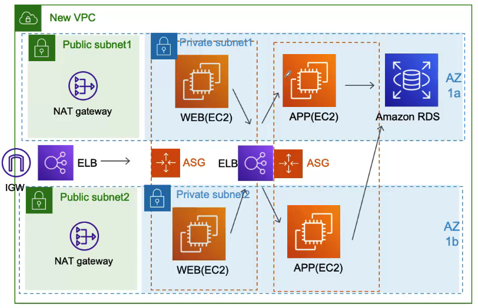

# VPC옮겨가기

### 기존 운영하던 INSTANCE도 새 VPC로 옮겨와야 되는데, AWS에서는 INSTANCE를 다은 VPC로 옮겨 올 수 있나요?
- 운영중인 Instance나 DB는 VPC로 옮길수는 없음
- 그런데 Instance는 AMI로 DB는 snapshot이라는걸 찍은 다음에 다시 만들면 됨
- ELB도 다시만들고, AutoScaling도 설정해야됨

### WEB 서버랑 APP 서버도 나눠야 한다는데
- WEB서버는 nginx를 사용하고 App 서버는 tomcat을 사용, 같은 서버에서 사용
- App 서버도 외부에서 접근할 수 있으면 위험함
- App 서버도 Private Subnet에 위치해야 할것 같음
- App 서버도 Autoscaling을 해줌

### 한번 해킹을 당했더니 보안에 좀더 신경이 감. 지금 아키텍처 문제가 없을까?
- WEB서버에 ssh 포트 열어놓고 저기에 접속한 다음에, APP, DB 서버를 접근 하는 방식으로 관리하는데 문제가 있어보임
- WEB서버에 누군가 침입하면 APP, DB 서버들 다 문제가 생길 수 있음
- 어차피 ELB가 있는데 외부에서 직접 WEB 서버에는 접근할 필요가 없는거 같음
- WEB 서버도 Private subnet에 옮기고 ELB만 사용자들이 접근할수 있도록 노출점을 줄이는게 보안상에 좋음

### WEB 서버랑 APP 서버를 나누다 보니까 좀 이상한 문제가 생김
- WEB 서버가 Autoscaling으로 늘어는건 괜찮음, 미리 만들어둔 WEB 서버 AMI를 통해만들어지니까. 그래서 APP 서버들이 주소를 알고 있으니까
- 근데 APP 서버가 늘어나면 WEB 서버의 설정을 바꿔야 함. 새로만들어진 APP서버의 주소를 추가해야함
- 그리고 하나의 APP서버에 장애가 나면 WEB서버들에게 퍼져서 전체 시스템이 죽어 버리는 문제가 생길수 있음
- 서버끼리 너무 Tight하게 연결되어 있어서 생기는 문제
- LOOSE하게 아키텍처를 바꿔야 함

### WEB서버랑 APP서버 사이에 ELB를 넣어서 관리를 편하게 하려고 함
- ELB를 중간에 넣어줌. 로드 밸런서는 부하를 분산할 때 EC2 인스턴스가 문제가 있으면 그쪽으로 가는 트래픽을 차단하는 기능도 있음
- 그럼 장애가 퍼지는걸 막을 수 있음
- 그럼 장애난 EC2은 어떻게 되는가? 그건 Autoscaling 기능에 의해 제거되고 다시 만들어짐