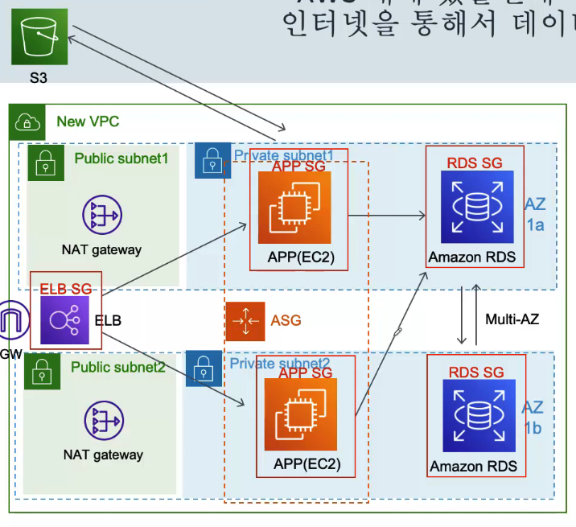

## 요즘 웹 애플리케이션을 만들때, 사용하는 프론트엔드 기술들은 일반적으로 S3에 배포 한다고 합니다. 그럼 웹 서버가 필요 업겠네요. 웹서버 대신에 S3를 사용할 겁니다.
- 웹서버의 기능을 하는 인스턴스를 지우고 S3의 스태틱 웹사이트 호스팅 기능으로 웹서버를 대체 함
- 웹 애플리케이션을 만들 때 많이 사용하는 프론트엔드 기술들인 리액트, 뷰, 스벨트 등 같은 자바스크립트 프레임워크들을 배포할 때는 일반적으로 S3에 배포하고 스태틱 웹사이트 호스팅 기능을 활성화
- S3는 관리를 안해도 되는가?
- S3는 완전 관리형 서비스. AWS가 모든걸 관리하기 때문에, 사용자는 신경 쓸 필요 없다는 얘기
- 일단 관리해야 할 인스턴스가 줄어들어서 좋은거 같음

## 그런데 이상한게 제가 S3에 파일을 업로드 할 때, APP서버나 S3나 다AWS 내에 있을텐데 내부방으로 안 올리고, 인터넷을 통해서 데이터를 올리는거 같아요.
- APP 서버에서 변환된 동영상과 이미지들은 NAT 게이트웨이를 통해 인터넷으로 나갔다가 S3로 다시 업로드 됨
- EC2나 S3나 다 AWS라는 거대 인프라 안에 있는거 아닌가?
- 그냥 내부망 올리면 되는데 굳이 저렇게 인터넷으로 올려야 되나?
- AWS 서비스는 모두 독립적임. 그래서 모두 API 콜을 통해 동작함
- 내부방을 통해 올리는 방법도 제공. VPC Endpoint를 사용하면 됨